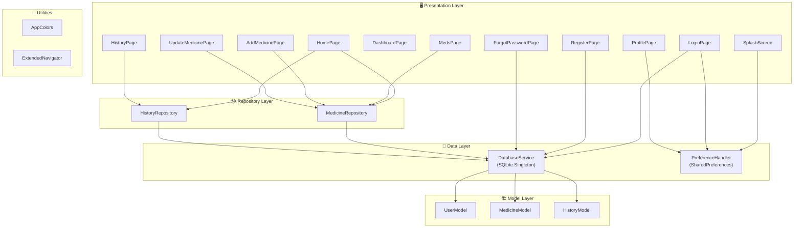
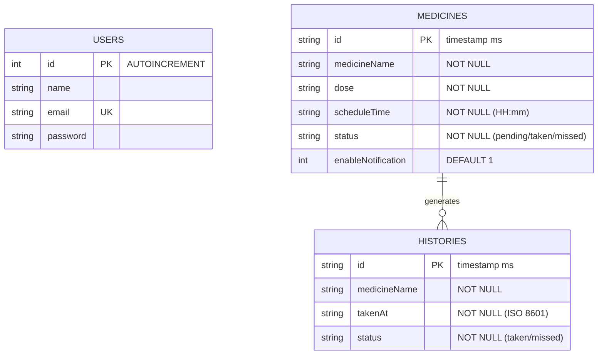
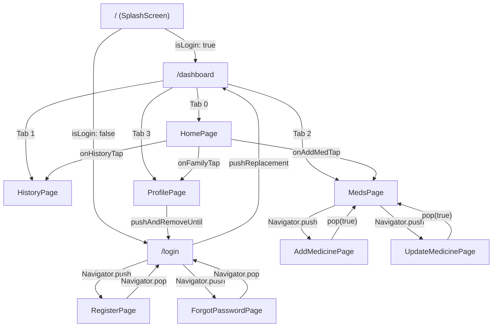

# 🎨 Design Document
# JagaDosis — Pendamping Pintar Jadwal Obat Anda

---

| **Informasi Dokumen** | |
|---|---|
| **Nama Produk** | JagaDosis |
| **Versi Dokumen** | 1.0 |
| **Versi Aplikasi** | 1.0.0+1 |
| **Tanggal** | 19 Juni 2026 |
| **Framework** | Flutter (SDK ^3.11.5) |
| **Design Language** | Material 3 + Custom Design Tokens |
| **State Management** | StatefulWidget (built-in `setState`) |

---

## 1. Filosofi Desain

### 1.1 Prinsip Utama

| Prinsip | Deskripsi |
|---|---|
| **Clean & Minimal** | Antarmuka bersih tanpa clutter, fokus pada informasi penting |
| **Medical Trust** | Palet warna biru medis membangun kepercayaan pengguna |
| **Accessibility First** | Font besar, kontras tinggi, bahasa Indonesia sepenuhnya |
| **Feedback-Driven** | Setiap aksi memberikan respons visual (SnackBar, Modal, Animasi) |
| **Offline-First** | Desain tidak bergantung pada elemen cloud/online |

### 1.2 Target Estetika

```
┌──────────────────────────────────────────┐
│  Material 3 Foundation                   │
│  ┌────────────────────────────────────┐  │
│  │  Custom Color Tokens (AppColors)   │  │
│  │  ┌──────────────────────────────┐  │  │
│  │  │  Google Fonts Typography     │  │  │
│  │  │  ┌────────────────────────┐  │  │  │
│  │  │  │  Component-level Style │  │  │  │
│  │  │  └────────────────────────┘  │  │  │
│  │  └──────────────────────────────┘  │  │
│  └────────────────────────────────────┘  │
└──────────────────────────────────────────┘
```

---

## 2. Design System

### 2.1 Color Palette

Didefinisikan di [`app_colors.dart`](file:///d:/project/jagadosis/lib/utils/app_colors.dart):

```dart
class AppColors {
  static const Color medicalBlue       = Color(0xFF005AB6);
  static const Color backgroundBlue   = Color(0xFFF9F9FF);
  static const Color surfaceWhite     = Color(0xFFFFFFFF);
  static const Color primaryContainer = Color(0xFFD7E3FF);
  static const Color onPrimaryContainer = Color(0xFF001B3F);
  static const Color textDark         = Color(0xFF191C22);
  static const Color textGrey         = Color(0xFF414753);
  static const Color outlineVariant   = Color(0xFFC1C6D5);
  static const Color wellnessGreen    = Color(0xFF006D37);
}
```

#### Color Usage Matrix

| Token | Hex | Contoh Penggunaan |
|---|---|---|
| `medicalBlue` | `#005AB6` | Primary CTA, AppBar title, active nav, focused border, pending med card background |
| `backgroundBlue` | `#F9F9FF` | Scaffold background semua halaman utama |
| `surfaceWhite` | `#FFFFFF` | Card background, AppBar bg, Bottom Nav bg, button foreground |
| `primaryContainer` | `#D7E3FF` | Badge counter bg (withAlpha 50), active nav indicator bg |
| `onPrimaryContainer` | `#001B3F` | Teks header gelap (belum banyak digunakan langsung) |
| `textDark` | `#191C22` | Heading text, nama obat, tanggal, nav icon non-active |
| `textGrey` | `#414753` | Body text, subtitle, secondary info, non-active icon |
| `outlineVariant` | `#C1C6D5` | Card border, input field border, divider, progress bg |
| `wellnessGreen` | `#006D37` | Status `taken`, adherence circle, success SnackBar, dot indicator |

#### Warna Tambahan (Inline)

| Warna | Hex / Value | Penggunaan |
|---|---|---|
| Splash Gradient Top | `#0F6BD7` | Splash screen gradient atas |
| Splash Gradient Bottom | `#003D7C` | Splash screen gradient bawah |
| Login Gradient | `#E6EEFF → transparent` | Subtle top decoration pada login |
| Orange (Sirup) | `#934700` | Icon warna untuk obat sirup/sendok |
| Red (Danger) | `#EB5757` | Tombol Keluar, Kontak Darurat, delete actions |
| Teal | `Colors.teal` | Icon warna untuk obat tetes |

---

### 2.2 Tipografi

Menggunakan [Google Fonts](https://pub.dev/packages/google_fonts) (`^8.1.0`):

| Font Family | Penggunaan | Weight | Ukuran |
|---|---|---|---|
| **Plus Jakarta Sans** | Heading, judul section, nama obat, AppBar title | Bold (`w700`) | 13–32px |
| **Inter** | Body text, subtitle, label, button text, input field | Regular (`w400`), Medium (`w500`), SemiBold (`w600`), Bold (`w700`) | 10–16px |

#### Contoh Penggunaan Spesifik

```dart
// AppBar Title
GoogleFonts.plusJakartaSans(fontWeight: FontWeight.bold, color: AppColors.medicalBlue)

// Greeting Header (24px)
GoogleFonts.plusJakartaSans(fontSize: 24.0, fontWeight: FontWeight.bold, color: AppColors.textDark)

// Body Subtitle (14px)
GoogleFonts.inter(fontSize: 14.0, fontWeight: FontWeight.w500, color: AppColors.textGrey)

// Button Label (14-16px)
GoogleFonts.inter(fontWeight: FontWeight.bold, fontSize: 14.0)

// Tiny Label / Badge (10px)
GoogleFonts.inter(fontSize: 10.0, fontWeight: FontWeight.bold, color: AppColors.medicalBlue)
```

---

### 2.3 Spacing & Layout

| Property | Nilai | Catatan |
|---|---|---|
| **Grid System** | 4px increments | 4, 8, 12, 16, 20, 24, 28, 32 |
| **Page Padding** | `horizontal: 24.0, vertical: 16.0` | Konsisten di semua page |
| **Card Padding** | `16.0 – 24.0` | Tergantung konteks |
| **Section Gap** | `24.0` | Antar section utama |
| **Inner Spacing** | `4.0 – 12.0` | Antar elemen dalam komponen |
| **Card Border Radius** | `16.0` | Konsisten di semua card |
| **Button Border Radius** | `8.0 – 12.0` | Tergantung konteks |
| **Input Border Radius** | `12.0` | Semua TextFormField |
| **Nav Item Radius** | `12.0` | Bottom navigation items |

---

### 2.4 Elevation & Shadow

```dart
// Standard Card Shadow
BoxShadow(
  color: Colors.black.withAlpha(5–10),
  blurRadius: 8.0–16.0,
  offset: Offset(0, 2–4),
)

// Splash Logo Shadow (Premium)
BoxShadow(
  color: Colors.black.withAlpha(40),
  blurRadius: 16.0,
  offset: Offset(0, 8),
)

// Bottom Navigation Shadow
BoxShadow(
  color: Colors.black.withAlpha(15),
  blurRadius: 16.0,
  offset: Offset(0, -2),
)

// Primary Card Shadow (Pending Med)
BoxShadow(
  color: AppColors.medicalBlue.withAlpha(60),
  blurRadius: 16,
  offset: Offset(0, 4),
)
```

---

### 2.5 Animasi

| Komponen | Durasi | Curve | Tipe |
|---|---|---|---|
| Splash Logo Scale | 0–60% dari 2000ms | `Curves.elasticOut` | Scale 0→1 |
| Splash Logo Fade | 0–40% dari 2000ms | `Curves.easeIn` | Opacity 0→1 |
| Splash Title Slide | 40–80% dari 2000ms | `Curves.easeOutBack` | Translate Y 0.3→0 |
| Splash Tagline Fade | 60–100% dari 2000ms | `Curves.easeIn` | Opacity 0→1 |
| Splash → Next Page | 800ms | Default | `FadeTransition` |
| Auto Navigate | 4000ms delay | — | Timer-based |
| Nav Active Container | 200ms | Default | `AnimatedContainer` (color, padding) |
| History View Toggle | 250ms | `Curves.easeInOut` | `AnimatedContainer` (color, shadow) |
| History Fade In | 300ms | `Curves.easeInOut` | `FadeTransition` |
| Yearly Month Grid | 200ms | Default | `AnimatedContainer` (border, bg) |

---

### 2.6 Iconography

Menggunakan **Material Icons** built-in Flutter:

#### Navigation Icons

| Tab | Active | Inactive |
|---|---|---|
| Beranda | `Icons.home_rounded` | `Icons.home_outlined` |
| Riwayat | `Icons.history_rounded` | `Icons.history_outlined` |
| Obat | `Icons.medical_services_rounded` | `Icons.medical_services_outlined` |
| Profil | `Icons.person_rounded` | `Icons.person_outline_rounded` |

#### Medicine Type Icons

| Jenis | Icon | Warna |
|---|---|---|
| Tablet (default) | `Icons.medication_rounded` | `medicalBlue` (#005AB6) |
| Kapsul | `Icons.healing_rounded` | `wellnessGreen` (#006D37) |
| Sirup / Sendok | `Icons.vaccines_rounded` | Orange (#934700) |
| Tetes | `Icons.opacity_rounded` | `Colors.teal` |

#### Profile Menu Icons

| Menu | Icon | Warna |
|---|---|---|
| Data Diri | `Icons.person_outline_rounded` | `medicalBlue` |
| Pengaturan Notifikasi | `Icons.notifications_active_outlined` | `wellnessGreen` |
| Kontak Darurat | `Icons.emergency_outlined` | `#EB5757` |
| Pusat Bantuan | `Icons.help_center_outlined` | `textGrey` |

#### Time Group Icons (History)

| Waktu | Icon | Warna |
|---|---|---|
| Pagi (05–12) | `Icons.wb_sunny_rounded` | `#E65100` |
| Siang (12–18) | `Icons.wb_cloudy_rounded` | `medicalBlue` |
| Malam (18+) | `Icons.bedtime_rounded` | `textGrey` |

---

## 3. Arsitektur Aplikasi

### 3.1 Layer Architecture



### 3.2 Struktur Folder

```
lib/
├── main.dart                              # Entry point, routing, theme config
├── database/
│   ├── db_helper.dart                     # SQLite Singleton (DatabaseService)
│   └── preference_handler.dart            # SharedPreferences static wrapper
├── models/
│   ├── user_model.dart                    # User entity (toMap/fromMap)
│   ├── medicine_model.dart                # Medicine entity (toMap/fromMap/copyWith)
│   └── history_model.dart                 # History entity (toMap/fromMap, DateTime)
├── repositories/
│   ├── medicine_repository.dart           # CRUD obat via DatabaseService
│   └── history_repository.dart            # CRUD + query riwayat (by date/month/year)
├── screens/
│   ├── splash/
│   │   └── splash_screen.dart             # Animated splash (2s anim, 4s navigate)
│   ├── auth/
│   │   ├── login_page.dart                # Login form + validation
│   │   ├── register_page.dart             # Registration form
│   │   └── forgot_password_page.dart      # Password recovery
│   ├── dashboard_page.dart                # Bottom nav shell (4 tabs)
│   ├── home/
│   │   └── home_page.dart                 # Dashboard beranda + adherence
│   ├── meds/
│   │   ├── medicine_page.dart             # Daftar obat aktif + FAB
│   │   ├── add_medicine_page.dart         # Form tambah obat (multi-section)
│   │   └── update_medicine_page.dart      # Form edit obat (pre-filled)
│   ├── history/
│   │   └── history_page.dart              # Riwayat 3 mode kalender (1378 LOC)
│   └── profile/
│       └── profile_page.dart              # Profil + settings menu
├── utils/
│   └── app_colors.dart                    # Design tokens (9 warna)
├── extensions/
│   └── navigator.dart                     # BuildContext navigation helpers
└── services/                              # (Empty, reserved for future use)
```

---

## 4. Data Model & Skema Database

### 4.1 Database: `jagadosis.db` (SQLite v3)



### 4.2 Model Classes

#### [`UserModel`](file:///d:/project/jagadosis/lib/models/user_model.dart)

```dart
class UserModel {
  final String id;      // INTEGER dari DB, disimpan sebagai String
  final String name;
  final String email;
  final String password; // ⚠️ Plain text (lihat catatan keamanan)
}
```

#### [`MedicineModel`](file:///d:/project/jagadosis/lib/models/medicine_model.dart)

```dart
class MedicineModel {
  final String id;                  // Timestamp milliseconds
  final String medicineName;
  final String dose;                // Format: "500 Tablet • Sesudah Makan • 2x Sehari"
  final String scheduleTime;        // Format: "08:00" atau "08:00, 20:00"
  final String status;              // "pending" | "taken" | "missed"
  final bool enableNotification;    // Default: true
  
  // Includes copyWith() for immutable state updates
}
```

#### [`HistoryModel`](file:///d:/project/jagadosis/lib/models/history_model.dart)

```dart
class HistoryModel {
  final String id;              // Timestamp milliseconds
  final String medicineName;
  final DateTime takenAt;       // Stored as ISO 8601 string in DB
  final String status;          // "taken" | "missed"
}
```

---

## 5. Screen-by-Screen Breakdown

### 5.1 Splash Screen

**File**: [`splash_screen.dart`](file:///d:/project/jagadosis/lib/screens/splash/splash_screen.dart) (287 LOC)

```
┌─────────────────────────────────┐
│  ░░░ Gradient Background ░░░    │
│  (0F6BD7 → 003D7C)             │
│                                 │
│        ○ Decorative Circle      │
│          (white, alpha 20)      │
│                                 │
│      ┌─────────────────┐        │
│      │    ⬤ Logo.png   │        │
│      │  (196x196 circle)│       │
│      │  white bg, shadow│       │
│      └─────────────────┘        │
│                                 │
│   "Pendamping Pintar Jadwal     │
│        Obat Anda"               │
│    (Inter 14, white/alpha200)   │
│                                 │
│                                 │
│        ━━━━ progress bar        │
│           v1.0.0                │
│  ○ Decorative Circle            │
└─────────────────────────────────┘
```

**Animation Timeline** (2000ms total):

| Phase | Interval | Effect |
|---|---|---|
| Logo Scale | 0%–60% | `elasticOut` 0→1 |
| Logo Fade | 0%–40% | `easeIn` opacity 0→1 |
| Title Fade+Slide | 40%–80% | `easeOut` + `easeOutBack` |
| Tagline Fade | 60%–100% | `easeIn` opacity 0→1 |

**Navigation Logic**:
```
Timer(4s) → check PreferenceHandler.isLogin
  ├─ true  → DashboardPage (FadeTransition 800ms)
  └─ false → LoginPage (FadeTransition 800ms)
```

---

### 5.2 Login Page

**File**: [`login_page.dart`](file:///d:/project/jagadosis/lib/screens/auth/login_page.dart) (418 LOC)

```
┌─────────────────────────────────┐
│  ▓▓ Subtle Gradient (E6EEFF)    │
│     (top 35% height)            │
│                                 │
│         "JagaDosis"             │
│   (PlusJakartaSans 32, bold)    │
│                                 │
│  ┌───────────────────────────┐  │
│  │    "Selamat Datang"       │  │
│  │  "Silakan masuk untuk..." │  │
│  │                           │  │
│  │  📧 Email                 │  │
│  │  ┌─────────────────────┐  │  │
│  │  │ contoh@email.com    │  │  │
│  │  └─────────────────────┘  │  │
│  │                           │  │
│  │  🔒 Kata Sandi            │  │
│  │  ┌─────────────────────┐  │  │
│  │  │ ••••••••      👁️   │  │  │
│  │  └─────────────────────┘  │  │
│  │         Lupa Kata Sandi?  │  │
│  │                           │  │
│  │  ┌─────────────────────┐  │  │
│  │  │      Masuk          │  │  │ ← ElevatedButton (medicalBlue)
│  │  └─────────────────────┘  │  │
│  │  ┌─────────────────────┐  │  │
│  │  │      Daftar         │  │  │ ← OutlinedButton (medicalBlue border)
│  │  └─────────────────────┘  │  │
│  └───────────────────────────┘  │
│    Card: white, radius 16,      │
│    border outlineVariant,       │
│    shadow black/alpha10/blur24  │
└─────────────────────────────────┘
```

**Input Validation**:
- Email: required + RegExp `^[\w-\.]+@([\w-]+\.)+[\w-]{2,4}$`
- Password: required + min 6 chars
- Toggle visibility via `_obscurePassword` state

---

### 5.3 Dashboard (Navigation Shell)

**File**: [`dashboard_page.dart`](file:///d:/project/jagadosis/lib/screens/dashboard_page.dart) (169 LOC)

```
┌─────────────────────────────────┐
│  AppBar: "JagaDosis"            │
│  (PlusJakartaSans, bold, blue)  │
│  bg: white, elevation: 0.5      │
├─────────────────────────────────┤
│                                 │
│        [ Page Content ]         │
│    (switched by _selectedIndex) │
│                                 │
├─────────────────────────────────┤
│  BottomNav: rounded top corners │
│  shadow: black/alpha15/blur16   │
│                                 │
│  🏠 Beranda  🕐 Riwayat        │
│  💊 Obat     👤 Profil          │
│                                 │
│  Active: medicalBlue + bold     │
│  Inactive: textGrey + normal    │
│  AnimatedContainer 200ms        │
└─────────────────────────────────┘
```

**Tab Pages**:

| Index | Page | Callback dari HomePage |
|---|---|---|
| 0 | `HomePage` | `onAddMedTap → index 2`, `onHistoryTap → index 1`, `onFamilyTap → index 3` |
| 1 | `HistoryPage` | — |
| 2 | `MedsPage` | — |
| 3 | `ProfilePage` | — |

---

### 5.4 Home Page (Beranda)

**File**: [`home_page.dart`](file:///d:/project/jagadosis/lib/screens/home/home_page.dart) (576 LOC)

```
┌─────────────────────────────────┐
│  "Selamat Pagi, [userName]"     │  ← Dynamic greeting (Pagi/Siang/Malam)
│  "Rabu, 18 Juni 2026"           │  ← Indonesian date format
│                                 │
│  ┌───────────────────────────┐  │
│  │ Kepatuhan Hari Ini        │  │
│  │ "Bagus, mari minum obat   │  │
│  │  tepat waktu!"      ◐ 75% │  │  ← CircularProgressIndicator
│  └───────────────────────────┘  │     (wellnessGreen, stroke 5.5)
│                                 │
│  "Jadwal Terdekat"              │
│                                 │
│  ┌───────────────────────────┐  │
│  │  ⬤ 💊 Amoxicillin        │  │  ← medicalBlue bg, white text
│  │  │  Dosis: 500 Tablet     │  │
│  │  │  ⏰ 08:00, 20:00       │  │
│  │  │                        │  │
│  │  │ [✅ Tandai Sudah Diminum] │  ← white button, medicalBlue text
│  └───────────────────────────┘  │
│                                 │
│  (Pull-to-Refresh support)      │
└─────────────────────────────────┘
```

**Tiga State Tampilan**:

| State | Widget | Kondisi |
|---|---|---|
| Loading | `CircularProgressIndicator` | `_isLoading == true` |
| Empty | No medicines card + "Tambah Obat" CTA | `_medicines.isEmpty` |
| All Taken | ✅ green check + congratulatory text | `_nextPendingMedicine == null` |
| Pending | Blue card dengan detail obat + CTA | `_nextPendingMedicine != null` |

**Logika Adherence**:
```
adherencePercent = (takenCount / totalMedicines) × 100
```

**Logika Auto-Miss**:
```
For each medicine where status == 'pending':
  If ALL scheduleTime entries < current time:
    → Update status to 'missed'
    → Create HistoryModel with status 'missed'
```

---

### 5.5 Medicine Page (Daftar Obat)

**File**: [`medicine_page.dart`](file:///d:/project/jagadosis/lib/screens/meds/medicine_page.dart) (429 LOC)

```
┌─────────────────────────────────┐
│  "Daftar Obat Aktif"   [3 OBAT]│  ← Badge: primaryContainer/alpha50
│                                 │
│  ┌───────────────────────────┐  │
│  │ ⬤💊 Amoxicillin      ⋮  │  │  ← More vert → BottomSheet
│  │    500 Tablet             │  │
│  │    2x Sehari • Sesudah    │  │
│  │    ⏰ Pukul 08:00, 20:00  │  │
│  └───────────────────────────┘  │
│                                 │
│  ┌───────────────────────────┐  │
│  │ ⬤💚 Omeprazole      ⋮   │  │  ← Kapsul = wellnessGreen
│  │    20 Kapsul              │  │
│  │    1x Sehari • Sebelum    │  │
│  │    ⏰ Pukul 07:00         │  │
│  └───────────────────────────┘  │
│                                 │
│              [+ Tambah Obat]    │  ← FAB extended (medicalBlue)
└─────────────────────────────────┘
```

**Context Menu (BottomSheet)**:

```
┌─────────────────────────────────┐
│  🗑️ Hapus Obat    (redAccent)  │  → Confirmation AlertDialog
│  ✏️ Ubah Obat     (medicalBlue)│  → Navigate to UpdateMedicinePage
└─────────────────────────────────┘
```

**Icon Resolution Logic**:
```dart
final checkText = (form.isNotEmpty ? form : dosage).toLowerCase();
if (contains 'kapsul')           → healing_rounded + wellnessGreen
else if (contains 'sirup/sendok/ml') → vaccines_rounded + #934700
else if (contains 'tetes')       → opacity_rounded + teal
else                             → medication_rounded + medicalBlue
```

---

### 5.6 Add Medicine Page

**File**: [`add_medicine_page.dart`](file:///d:/project/jagadosis/lib/screens/meds/add_medicine_page.dart) (~25.3 KB)

**Form Sections**:

| Section | Fields |
|---|---|
| **Informasi Dasar** | Nama Obat (TextFormField), Dosis (number), Satuan Dosis (chip selector) |
| **Aturan Pakai** | Frekuensi (1x–4x Sehari/Sesuai Kebutuhan), Hubungan Makanan |
| **Waktu Konsumsi** | Time Pickers (jumlah sesuai frekuensi) |

**Satuan Dosis Options**:
```
Tablet | Kapsul | Sendok Makan (sdm) | Sendok Teh (sdt) | Tetes | Semprot | Sachet / Bungkus
```

**Frekuensi Options**:
```
1x Sehari | 2x Sehari | 3x Sehari | 4x Sehari | Sesuai Kebutuhan
```

**Hubungan Makanan Options**:
```
Sebelum Makan | Sesudah Makan | Bersama Makanan | Sebelum Tidur
```

**Data Save Format**:
```
id: DateTime.now().millisecondsSinceEpoch.toString()
dose: "{dosis} {satuan} • {hubungan_makan} • {frekuensi}"
scheduleTime: "08:00, 20:00"  (sorted chronologically)
status: "pending"
```

**Success Feedback**: Modal Bottom Sheet dengan animasi check icon ✅

---

### 5.7 History Page (Riwayat Konsumsi)

**File**: [`history_page.dart`](file:///d:/project/jagadosis/lib/screens/history/history_page.dart) (1378 LOC — halaman terbesar)

#### 5.7.1 Adherence Summary Card

```
┌───────────────────────────────┐
│  Ringkasan Kepatuhan          │
│  "Pertahankan konsistensi     │
│   minum obat Anda!"           │
│                        ◐ 85%  │  ← CircularProgressIndicator
└───────────────────────────────┘
```

#### 5.7.2 View Mode Toggle

```
┌─────────────────────────────────────┐
│  [Mingguan] [Bulanan] [Tahunan]     │
│   ^^^^^^^^                          │
│   Active: medicalBlue bg, white text│
│   AnimatedContainer 250ms easeInOut │
└─────────────────────────────────────┘
```

#### 5.7.3 Mode Mingguan (Weekly View)

```
  "Juni 2026"              [📅 Hari Ini]
  
  ┌───┐ ┌───┐ ┌███┐ ┌───┐ ┌───┐ ┌───┐ ┌───┐
  │Sen│ │Sel│ │Rab│ │Kam│ │Jum│ │Sab│ │Min│
  │16 │ │17 │ │18 │ │19 │ │20 │ │21 │ │22 │
  └───┘ └───┘ └███┘ └───┘ └───┘ └───┘ └───┘
                ▲ active (medicalBlue bg)
                  future dates dimmed
  
  "Rabu, 18 Juni"
  
  ☀️ Pagi
  ┌─ Amoxicillin ── taken ── 08:15 ─┐
  └──────────────────────────────────┘
  
  🌙 Malam
  ┌─ Omeprazole ── missed ── (tidak diminum) ─┐
  └────────────────────────────────────────────┘
```

**Time Group Partitioning**:
```
Pagi:  05:00 – 11:59  (☀️ wb_sunny, #E65100)
Siang: 12:00 – 17:59  (☁️ wb_cloudy, medicalBlue)
Malam: 18:00 – 04:59  (🌙 bedtime, textGrey)
```

#### 5.7.4 Mode Bulanan (Monthly View)

```
┌─────────────────────────────────┐
│  ◀  Juni 2026  ▶                │
│                                 │
│  Sen Sel Rab Kam Jum Sab Min    │
│                  1   2   3   4  │
│   5   6   7   8   9  10  11    │
│  12  13  14  15  16  17  18●   │  ← ● green dot = has logs
│  19  20  21  22  23  24  25    │     tap date → switch to weekly
│  26  27  28  29  30            │
│                                 │
│  Today: blue tinted bg          │
│  Selected: medicalBlue solid bg │
└─────────────────────────────────┘
```

#### 5.7.5 Mode Tahunan (Yearly View)

```
┌─────────────────────────────────┐
│  ◀  2026  ▶                     │
│                                 │
│  ┌─────┐ ┌─────┐ ┌─────┐ ┌─────┐
│  │ Jan │ │ Feb │ │ Mar │ │ Apr │
│  │  12 │ │   8 │ │  15 │ │   0 │  ← Log count per month
│  └─────┘ └─────┘ └─────┘ └─────┘
│  ┌─────┐ ┌█████┐ ┌─────┐ ┌─────┐
│  │ Mei │ │ Jun │ │ Jul │ │ Agu │  ← Current month highlighted
│  │  20 │ │  18 │ │     │ │     │
│  └─────┘ └█████┘ └─────┘ └─────┘
│  ...                             │
│  tap month → switch to monthly   │
└─────────────────────────────────┘
```

---

### 5.8 Profile Page

**File**: [`profile_page.dart`](file:///d:/project/jagadosis/lib/screens/profile/profile_page.dart) (238 LOC)

```
┌─────────────────────────────────┐
│                                 │
│         ┌──────────┐            │
│         │  👤 Avatar│            │
│         │  110x110  │  ✏️       │  ← Edit badge (36x36 circle)
│         └──────────┘            │
│         "[User Name]"           │
│                                 │
│  ┌───────────────────────────┐  │
│  │ 👤 Data Diri           ▸  │  │  ← medicalBlue accent
│  │    Informasi pribadi...   │  │
│  └───────────────────────────┘  │
│  ┌───────────────────────────┐  │
│  │ 🔔 Pengaturan Notifikasi ▸│  │  ← wellnessGreen accent
│  │    Atur pengingat obat... │  │
│  └───────────────────────────┘  │
│  ┌───────────────────────────┐  │
│  │ 🚨 Kontak Darurat      ▸  │  │  ← red accent
│  │    Nomor penting...       │  │
│  └───────────────────────────┘  │
│  ┌───────────────────────────┐  │
│  │ ❓ Pusat Bantuan        ▸  │  │  ← grey accent
│  │    FAQ dan panduan...     │  │
│  └───────────────────────────┘  │
│                                 │
│  ┌───────────────────────────┐  │
│  │     🚪 Keluar             │  │  ← Red button (#EB5757)
│  └───────────────────────────┘  │
└─────────────────────────────────┘
```

**Setting Card Anatomy**:
```
┌──────────────────────────────────────┐
│ ⬤ [icon]  Title (15px bold)    ▸    │
│   (accent    Subtitle (12px grey)    │
│    circle)                           │
│  44x44                               │
└──────────────────────────────────────┘
  Card: white bg, radius 16, border outlineVariant/alpha50
  Shadow: black/alpha5, blur 8, offset (0,2)
  InkWell with borderRadius 16
```

---

## 6. Komponen Reusable

### 6.1 Card Patterns

| Pola | Bg Color | Border | Shadow | Radius |
|---|---|---|---|---|
| Standard Card | `surfaceWhite` | `outlineVariant.withAlpha(50)` | `black/alpha5, blur 8` | `16.0` |
| Elevated Card | `surfaceWhite` | `outlineVariant.withAlpha(100)` | `black/alpha10, blur 16` | `16.0` |
| Primary Card | `medicalBlue` | — | `medicalBlue/alpha60, blur 16` | `16.0` |
| Calendar Container | `surfaceWhite` | `outlineVariant.withAlpha(50)` | `black/alpha8, blur 12` | `16.0` |

### 6.2 Button Patterns

| Tipe | Bg | Fg | Border | Height | Radius |
|---|---|---|---|---|---|
| Primary CTA | `medicalBlue` | `white` | — | `52.0` | `12.0` |
| Secondary CTA | `white` | `medicalBlue` | `medicalBlue, 2.0` | `52.0` | `12.0` |
| Inline CTA | `white` | `medicalBlue` | — | `48.0` | `10.0` |
| Danger | `#EB5757` | `white` | — | `52.0` | `12.0` |
| Text Button | `transparent` | `medicalBlue` | — | auto | — |
| FAB Extended | `medicalBlue` | `white` | — | auto | auto |

### 6.3 Input Field Pattern

```dart
TextFormField(
  decoration: InputDecoration(
    hintStyle: GoogleFonts.inter(fontSize: 14, color: textGrey/alpha178),
    prefixIcon: Icon(size: 20, color: textGrey),
    contentPadding: EdgeInsets.symmetric(horizontal: 16, vertical: 16),
    border: OutlineInputBorder(borderRadius: 12, borderSide: outlineVariant),
    enabledBorder: // same as border
    focusedBorder: OutlineInputBorder(borderRadius: 12, medicalBlue, width: 1.5),
    errorStyle: GoogleFonts.inter(fontSize: 12),
  ),
)
```

### 6.4 SnackBar Patterns

| Tipe | Bg Color | Durasi |
|---|---|---|
| Success | `wellnessGreen` | 2s |
| Error | `Colors.redAccent` | default |

---

## 7. Navigation Flow

### 7.1 Route Configuration

Didefinisikan di [`main.dart`](file:///d:/project/jagadosis/lib/main.dart):

```dart
routes: {
  '/':          (context) => SplashScreen(),
  '/login':     (context) => LoginPage(),
  '/dashboard': (context) => DashboardPage(),
}
```

### 7.2 Navigation Graph



### 7.3 Navigator Extensions

Didefinisikan di [`navigator.dart`](file:///d:/project/jagadosis/lib/extensions/navigator.dart):

```dart
extension ExtendedNavigator on BuildContext {
  push(Widget page)                    // MaterialPageRoute
  pushReplacement(Widget page)         // pushReplacement
  pushNamed(String routeName)          // Named route
  pushReplacementNamed(String route)   // Named replacement
  pushNamedAndRemoveUntil(...)         // Clear stack + push named
  pushAndRemoveAll(Widget page)        // Clear entire stack
  pop([result])                        // Pop current route
}
```

---

## 8. Data Layer Details

### 8.1 DatabaseService (Singleton)

**File**: [`db_helper.dart`](file:///d:/project/jagadosis/lib/database/db_helper.dart) (228 LOC)

```dart
class DatabaseService {
  // Singleton pattern
  static final _instance = DatabaseService._internal();
  factory DatabaseService() => _instance;
  
  // Database constants
  static const _dbName = 'jagadosis.db';
  static const _dbVersion = 3;
  
  // Generic CRUD methods
  Future<int> insert(table, data)         // ConflictAlgorithm.replace
  Future<List<Map>> query(table, {where, whereArgs, orderBy})
  Future<int> update(table, data, {where, whereArgs})
  Future<int> delete(table, {where, whereArgs})
  
  // User-specific methods
  Future<bool> registerUser(UserModel)
  Future<UserModel?> loginUser(email, password)
  Future<List<UserModel>> getAllUsers()
  Future<void> deleteUser(int id)
  Future<bool> updateUser(UserModel)
}
```

### 8.2 PreferenceHandler (Static)

**File**: [`preference_handler.dart`](file:///d:/project/jagadosis/lib/database/preference_handler.dart) (41 LOC)

```dart
class PreferenceHandler {
  // Keys: "isLogin", "userName", "userEmail"
  
  static Future<void> init()                  // Called in main()
  static Future<void> setLogin(bool)
  static bool get isLogin
  static Future<void> saveUser(name, email)   // Sets all 3 keys
  static String get userName
  static String get userEmail
  static Future<void> logOut()                // Removes all 3 keys
}
```

### 8.3 Repository Pattern

#### [`MedicineRepository`](file:///d:/project/jagadosis/lib/repositories/medicine_repository.dart)

```dart
class MedicineRepository {
  Future<void> addMedicine(MedicineModel)
  Future<List<MedicineModel>> getAllMedicines()
  Future<void> updateMedicine(MedicineModel)
  Future<void> deleteMedicine(String id)
}
```

#### [`HistoryRepository`](file:///d:/project/jagadosis/lib/repositories/history_repository.dart)

```dart
class HistoryRepository {
  Future<void> addHistory(HistoryModel)
  Future<List<HistoryModel>> getAllHistories()          // ORDER BY takenAt DESC
  Future<List<HistoryModel>> getHistoriesByDate(DateTime)  // LIKE 'yyyy-MM-dd%'
  Future<List<HistoryModel>> getHistoriesByMonth(year, month)  // BETWEEN
  Future<List<HistoryModel>> getHistoriesByYear(year)  // BETWEEN
}
```

---

## 9. Theme Configuration

Didefinisikan di [`main.dart`](file:///d:/project/jagadosis/lib/main.dart):

```dart
ThemeData(
  useMaterial3: true,
  colorScheme: ColorScheme.fromSeed(
    seedColor: AppColors.medicalBlue,
    primary: AppColors.medicalBlue,
  ),
)
```

**Initialization Sequence**:
```dart
void main() async {
  WidgetsFlutterBinding.ensureInitialized();
  await initializeDateFormatting('id_ID', null);  // Indonesian locale
  await PreferenceHandler.init();                 // SharedPreferences
  runApp(const MyApp());
}
```

---

## 10. Assets

### 10.1 Image Assets

| File | Ukuran | Penggunaan |
|---|---|---|
| `assets/images/logo.png` | 257 KB | Splash screen logo |
| `assets/images/logo_baru.png` | 79 KB | Alternative logo |
| `assets/images/logo_baru2.png` | 292 KB | Alternative logo v2 |
| `assets/icon/logo.png` | — | App launcher icon (flutter_launcher_icons) |

### 10.2 Fonts

Semua font dimuat runtime via `google_fonts` package:
- **Plus Jakarta Sans**: Heading font
- **Inter**: Body/UI font

---

## 11. Statistik Codebase

| Metrik | Nilai |
|---|---|
| **Total Dart Files** | 21 |
| **Total LOC (estimasi)** | ~5,500+ |
| **File Terbesar** | `history_page.dart` (1,378 LOC / 44.6 KB) |
| **File Terkecil** | `app_colors.dart` (14 LOC / 562 B) |
| **Architecture Pattern** | Repository Pattern (Layered) |
| **State Management** | StatefulWidget (`setState`) |
| **Design Language** | Material 3 + Custom Tokens |
| **Database** | SQLite via `sqflite` (local-only) |
| **Session** | `SharedPreferences` (non-encrypted) |

---

## 12. Catatan Keamanan & Improvement

> [!WARNING]
> Berikut adalah catatan penting terkait keamanan dan area yang perlu ditingkatkan:

| Area | Status Saat Ini | Rekomendasi |
|---|---|---|
| Password Storage | ⚠️ Plain text di SQLite | 🔒 Implementasi hashing (bcrypt/argon2) |
| Session Storage | SharedPreferences (non-encrypted) | 🔒 `flutter_secure_storage` |
| Database | Tidak terenkripsi | 🔒 SQLCipher |
| Data Backup | Tidak ada | 📦 Export/Import JSON/CSV |
| Notifikasi | Package terdaftar, belum aktif | 🔔 Implementasi `flutter_local_notifications` |
| Daily Reset | Status obat tidak auto-reset | ⏰ Background service / WorkManager |
| Dark Mode | Tidak tersedia | 🌙 Theme switching |

---

> [!TIP]
> Dokumen design ini disusun berdasarkan analisis langsung terhadap **seluruh source code** project JagaDosis. Setiap detail — mulai dari warna hex, shadow values, animation curves, hingga logic flow — diambil dari implementasi aktual pada codebase v1.0.0.
