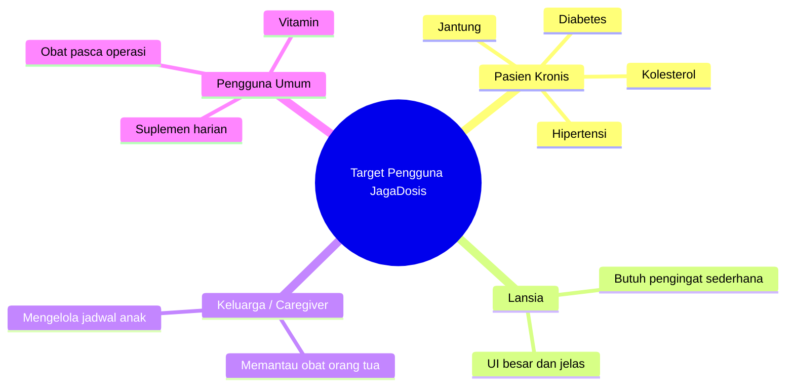
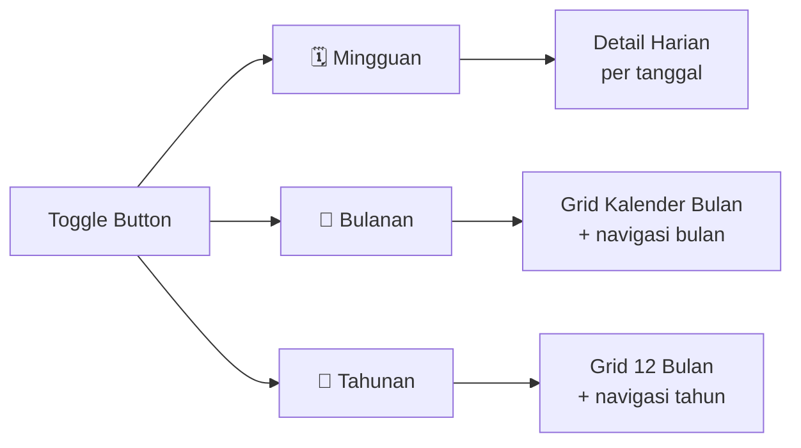
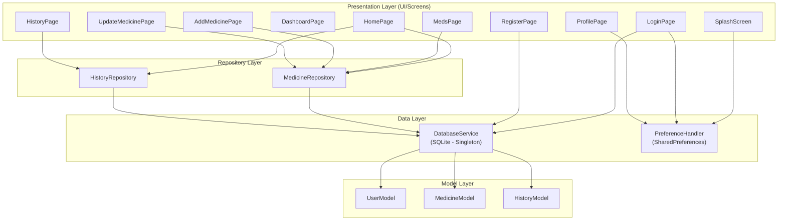
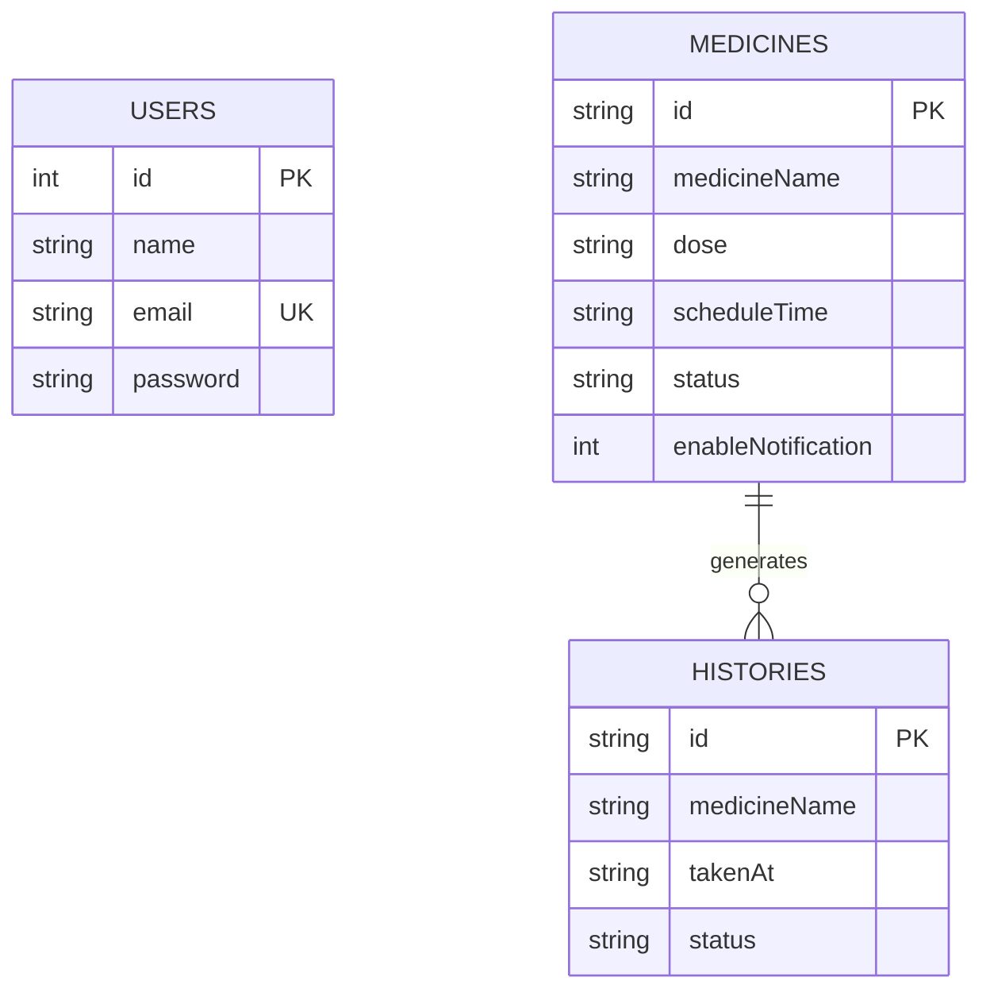
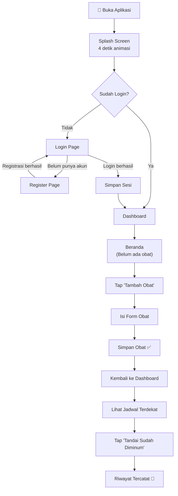
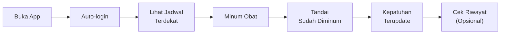

# 📋 Product Requirements Document (PRD)
# JagaDosis — Pendamping Pintar Jadwal Obat Anda

---

| **Informasi Dokumen** | |
|---|---|
| **Nama Produk** | JagaDosis |
| **Versi Dokumen** | 1.0 |
| **Versi Aplikasi** | 1.0.0+1 |
| **Tanggal** | 18 Juni 2026 |
| **Platform** | Android, iOS, Web, Windows, macOS, Linux (Flutter Multi-platform) |
| **Bahasa Antarmuka** | Bahasa Indonesia |
| **Status** | In Development |

---

## 1. Executive Summary

**JagaDosis** adalah aplikasi mobile berbasis Flutter yang dirancang sebagai pendamping pintar untuk membantu pengguna mengelola jadwal minum obat secara teratur dan tepat waktu. Aplikasi ini menyediakan fitur pencatatan obat, pengingat jadwal, pelacakan riwayat konsumsi, serta monitoring tingkat kepatuhan minum obat harian — semuanya dengan antarmuka yang bersih, modern, dan mudah digunakan.

> [!IMPORTANT]
> Aplikasi ini menggunakan penyimpanan lokal (SQLite) dan tidak memerlukan koneksi internet untuk beroperasi, sehingga cocok digunakan oleh segala kalangan termasuk pengguna di daerah dengan konektivitas terbatas.

---

## 2. Latar Belakang & Permasalahan

### 2.1 Konteks Permasalahan

Kepatuhan minum obat (*medication adherence*) merupakan salah satu tantangan terbesar dalam dunia kesehatan. Menurut WHO, sekitar **50% pasien dengan penyakit kronis tidak mengonsumsi obat sesuai resep**. Ketidakpatuhan ini menyebabkan:

- ⚠️ Memburuknya kondisi kesehatan pasien
- 💰 Meningkatnya biaya perawatan kesehatan
- 🏥 Meningkatnya angka rawat inap ulang
- ❌ Resistensi obat (terutama antibiotik)

### 2.2 Gap yang Diatasi

| Masalah | Solusi JagaDosis |
|---|---|
| Lupa jadwal minum obat | Pengingat jadwal otomatis dengan alarm |
| Tidak ada catatan konsumsi obat | Riwayat konsumsi obat terdokumentasi |
| Sulit memantau kepatuhan | Dashboard kepatuhan harian visual |
| Informasi dosis obat tersebar | Daftar obat terpusat dengan detail dosis |
| Aplikasi kesehatan berbahasa asing | Antarmuka sepenuhnya Bahasa Indonesia |

---

## 3. Tujuan Produk

### 3.1 Tujuan Utama
1. **Meningkatkan kepatuhan minum obat** pengguna melalui sistem pengingat yang terintegrasi
2. **Menyediakan catatan konsumsi obat** yang rapi dan mudah diakses
3. **Memberikan visualisasi kepatuhan** harian yang memotivasi pengguna

### 3.2 Key Results (KR)
- KR1: Pengguna dapat mencatat dan mengelola ≥1 jadwal obat aktif
- KR2: Pengguna dapat melacak riwayat minum obat harian, bulanan, dan tahunan
- KR3: Pengguna mendapatkan feedback visual kepatuhan minum obat ≥80%
- KR4: Proses registrasi dan login pengguna berjalan lancar tanpa kendala

---

## 4. Target Pengguna

### 4.1 Persona Utama



### 4.2 Karakteristik Pengguna

| Aspek | Detail |
|---|---|
| **Usia** | 18 – 70+ tahun |
| **Kemampuan Teknologi** | Dasar hingga menengah |
| **Kebutuhan Aksesibilitas** | Font besar, kontras warna tinggi |
| **Bahasa** | Indonesia |
| **Konektivitas** | Bisa offline (tanpa internet) |

---

## 5. Fitur-Fitur Produk

### 5.1 Modul Autentikasi (Authentication)

#### F-AUTH-01: Splash Screen
- **Deskripsi**: Layar pembuka aplikasi dengan animasi premium (logo scale + fade + tagline)
- **Behavior**:
  - Menampilkan logo JagaDosis dengan animasi `elasticOut`
  - Menampilkan tagline: *"Pendamping Pintar Jadwal Obat Anda"*
  - Durasi animasi: 2 detik, auto-navigate: 4 detik
  - Cek status login → jika sudah login, langsung ke Dashboard
  - Jika belum login, navigasi ke halaman Login
- **File terkait**: [splash_screen.dart](file:///d:/project/jagadosis/lib/screens/splash/splash_screen.dart)

#### F-AUTH-02: Registrasi Pengguna
- **Deskripsi**: Formulir pendaftaran akun baru
- **Input Fields**:
  - Nama Lengkap (wajib)
  - Email (wajib, unik, validasi format)
  - Kata Sandi (wajib, minimal 6 karakter)
- **Validasi**:
  - Email format validation via RegExp
  - Password minimum length check
  - Email uniqueness di database
- **File terkait**: [register_page.dart](file:///d:/project/jagadosis/lib/screens/auth/register_page.dart)

#### F-AUTH-03: Login Pengguna
- **Deskripsi**: Formulir masuk ke akun
- **Input Fields**:
  - Email
  - Kata Sandi (dengan toggle visibility)
- **Behavior**:
  - Validasi kredensial terhadap database SQLite
  - Menyimpan sesi login via `SharedPreferences`
  - Navigasi ke Dashboard setelah berhasil
  - Menampilkan SnackBar error jika gagal
- **File terkait**: [login_page.dart](file:///d:/project/jagadosis/lib/screens/auth/login_page.dart)

#### F-AUTH-04: Lupa Kata Sandi
- **Deskripsi**: Halaman untuk reset kata sandi
- **File terkait**: [forgot_password_page.dart](file:///d:/project/jagadosis/lib/screens/auth/forgot_password_page.dart)

#### F-AUTH-05: Manajemen Sesi
- **Deskripsi**: Persistensi status login pengguna
- **Implementasi**:
  - `SharedPreferences` menyimpan: `isLogin`, `userName`, `userEmail`
  - Auto-login pada app restart jika sesi masih aktif
  - Logout menghapus seluruh data sesi
- **File terkait**: [preference_handler.dart](file:///d:/project/jagadosis/lib/database/preference_handler.dart)

---

### 5.2 Modul Dashboard & Navigasi

#### F-DASH-01: Bottom Navigation Bar
- **Deskripsi**: Navigasi utama dengan 4 tab
- **Tab Items**:

| Index | Label | Icon (Active) | Icon (Inactive) |
|---|---|---|---|
| 0 | Beranda | `home_rounded` | `home_outlined` |
| 1 | Riwayat | `history_rounded` | `history_outlined` |
| 2 | Obat | `medical_services_rounded` | `medical_services_outlined` |
| 3 | Profil | `person_rounded` | `person_outline_rounded` |

- **Behavior**: Animated container dengan transisi warna dan bold text
- **File terkait**: [dashboard_page.dart](file:///d:/project/jagadosis/lib/screens/dashboard_page.dart)

#### F-DASH-02: Halaman Beranda (Home Page)
- **Deskripsi**: Dashboard utama yang menampilkan ringkasan informasi penting
- **Komponen UI**:
  1. **Greeting Section** — Sapaan dinamis berdasarkan waktu (Pagi/Siang/Malam) + nama pengguna
  2. **Tanggal Hari Ini** — Format Indonesia (contoh: *"Rabu, 18 Juni 2026"*)
  3. **Kartu Kepatuhan Harian** — Circular progress indicator dengan persentase kepatuhan
  4. **Jadwal Terdekat** — Kartu obat berikutnya yang harus diminum (status `pending`)
  5. **Tombol "Tandai Sudah Diminum"** — Menandai obat sebagai sudah dikonsumsi
- **State Management**:
  - Menghitung `adherencePercent` = (jumlah obat `taken` / total obat) × 100
  - Menampilkan obat `pending` pertama berdasarkan urutan jadwal waktu
  - Support Pull-to-Refresh via `RefreshIndicator`
- **File terkait**: [home_page.dart](file:///d:/project/jagadosis/lib/screens/home/home_page.dart)

---

### 5.3 Modul Manajemen Obat (Medication Management)

#### F-MED-01: Daftar Obat Aktif
- **Deskripsi**: Menampilkan semua obat yang terdaftar
- **Komponen UI**:
  - Judul section + badge counter (*"3 OBAT"*)
  - Kartu obat dengan icon dinamis berdasarkan jenis obat
  - Informasi yang ditampilkan per kartu: Nama, Dosis, Instruksi, Jadwal
  - Menu konteks (Bottom Sheet): **Hapus Obat** / **Ubah Obat**
  - FAB: "Tambah Obat"
  - Empty state illustration jika belum ada obat
- **Icon Mapping**:

| Jenis Obat | Icon | Warna |
|---|---|---|
| Tablet (default) | `medication_rounded` | Medical Blue `#005AB6` |
| Kapsul | `healing_rounded` | Wellness Green `#006D37` |
| Sirup / ml | `vaccines_rounded` | Orange `#934700` |
| Tetes | `opacity_rounded` | Teal |

- **File terkait**: [medicine_page.dart](file:///d:/project/jagadosis/lib/screens/meds/medicine_page.dart)

#### F-MED-02: Tambah Obat Baru
- **Deskripsi**: Formulir penambahan obat baru yang komprehensif
- **Section 1 — Informasi Dasar**:
  - Nama Obat (TextFormField, wajib, validasi non-empty)
  - Dosis + Satuan (contoh: "500 Tablet")
- **Pilihan Satuan Dosis**:

| Opsi |
|---|
| Tablet |
| Kapsul |
| Sendok Makan (sdm) |
| Sendok Teh (sdt) |
| Tetes |
| Semprot |
| Sachet / Bungkus |

- **Section 2 — Aturan Pakai & Waktu**:
  - Frekuensi: 1x, 2x, 3x, 4x Sehari, Sesuai Kebutuhan
  - Hubungan dengan Makanan: Sebelum Makan, Sesudah Makan, Bersama Makanan, Sebelum Tidur
  - Waktu Konsumsi (Time Picker) — jumlah alarm dinamis sesuai frekuensi
- **Penyimpanan Data**:
  - ID: timestamp milliseconds
  - Dose format: `"{dosis} {satuan} • {hubungan makan} • {frekuensi}"`
  - Schedule: waktu diurutkan kronologis, format `HH:mm`
  - Status awal: `pending`
- **Success Feedback**: Modal Bottom Sheet dengan animasi check icon
- **File terkait**: [add_medicine_page.dart](file:///d:/project/jagadosis/lib/screens/meds/add_medicine_page.dart)

#### F-MED-03: Update Obat
- **Deskripsi**: Edit data obat yang sudah ada
- **Behavior**: Pre-fill form dengan data obat existing, simpan perubahan
- **File terkait**: [update_medicine_page.dart](file:///d:/project/jagadosis/lib/screens/meds/update_medicine_page.dart)

#### F-MED-04: Hapus Obat
- **Deskripsi**: Menghapus obat dari daftar
- **Behavior**: Konfirmasi dialog → hapus dari database → reload list

#### F-MED-05: Tandai Sudah Diminum
- **Deskripsi**: Menandai obat sebagai sudah dikonsumsi
- **Behavior**:
  1. Update status obat ke `taken` di tabel `medicines`
  2. Buat record baru di tabel `histories` (timestamp + status `taken`)
  3. Reload data beranda
  4. Tampilkan SnackBar konfirmasi hijau

---

### 5.4 Modul Riwayat Konsumsi (Consumption History)

#### F-HIST-01: Riwayat dengan Tiga Mode Tampilan
- **Deskripsi**: Halaman riwayat konsumsi obat dengan kalender interaktif
- **Mode Tampilan**:



#### F-HIST-02: Mode Mingguan (Weekly View)
- Menampilkan 7 hari dalam satu minggu (horizontal scroll)
- Tanggal aktif di-highlight, hari depan (future) dimuted
- Detail log harian dikelompokkan per waktu: **Pagi** (05–12), **Siang** (12–18), **Malam** (18+)
- Tombol "Hari Ini" untuk quick-navigate

#### F-HIST-03: Mode Bulanan (Monthly View)
- Grid kalender bulanan penuh (Monday-first)
- Navigasi bulan sebelumnya/selanjutnya
- Indikator dot hijau pada tanggal yang memiliki log
- Tap tanggal → switch ke weekly mode untuk detail

#### F-HIST-04: Mode Tahunan (Yearly View)
- Grid 4×3 bulan dalam satu tahun
- Navigasi tahun sebelumnya/selanjutnya
- Counter jumlah log per bulan
- Tap bulan → switch ke monthly mode

#### F-HIST-05: Kartu Adherence Summary
- Circular progress indicator kepatuhan keseluruhan
- Motivational text dinamis berdasarkan persentase

- **File terkait**: [history_page.dart](file:///d:/project/jagadosis/lib/screens/history/history_page.dart)

---

### 5.5 Modul Profil Pengguna (User Profile)

#### F-PROF-01: Tampilan Profil
- **Deskripsi**: Halaman profil pengguna dengan informasi akun
- **Komponen UI**:
  - Avatar placeholder dengan icon edit
  - Nama pengguna (dari `SharedPreferences`)
  - Menu Settings:

| Menu | Deskripsi | Icon | Warna |
|---|---|---|---|
| Data Diri | Informasi pribadi dan rekam medis | `person_outline` | Medical Blue |
| Pengaturan Notifikasi | Atur pengingat obat dan alarm | `notifications_active` | Wellness Green |
| Kontak Darurat | Nomor penting dan dokter keluarga | `emergency` | Red `#EB5757` |
| Pusat Bantuan | FAQ dan panduan penggunaan | `help_center` | Grey |

  - Tombol **Keluar** (Logout) berwarna merah

- **File terkait**: [profile_page.dart](file:///d:/project/jagadosis/lib/screens/profile/profile_page.dart)

---

## 6. Arsitektur Teknis

### 6.1 Pola Arsitektur



### 6.2 Struktur Folder Project

```
lib/
├── main.dart                          # Entry point
├── database/
│   ├── db_helper.dart                 # SQLite service (Singleton)
│   └── preference_handler.dart        # SharedPreferences wrapper
├── models/
│   ├── user_model.dart                # User data model
│   ├── medicine_model.dart            # Medicine data model
│   └── history_model.dart             # History data model
├── repositories/
│   ├── medicine_repository.dart       # CRUD obat
│   └── history_repository.dart        # CRUD + query riwayat
├── screens/
│   ├── splash/splash_screen.dart      # Splash screen
│   ├── auth/
│   │   ├── login_page.dart            # Login
│   │   ├── register_page.dart         # Register
│   │   └── forgot_password_page.dart  # Forgot password
│   ├── dashboard_page.dart            # Main navigation shell
│   ├── home/home_page.dart            # Beranda
│   ├── meds/
│   │   ├── medicine_page.dart         # Daftar obat
│   │   ├── add_medicine_page.dart     # Tambah obat
│   │   └── update_medicine_page.dart  # Edit obat
│   ├── history/history_page.dart      # Riwayat konsumsi
│   └── profile/profile_page.dart      # Profil pengguna
├── utils/
│   └── app_colors.dart                # Design token warna
└── extensions/
    └── navigator.dart                 # BuildContext navigation helpers
```

---

## 7. Data Model & Skema Database

### 7.1 Database: `jagadosis.db` (SQLite, Version 3)

#### Tabel `users`

| Kolom | Tipe | Constraint | Keterangan |
|---|---|---|---|
| `id` | INTEGER | PRIMARY KEY AUTOINCREMENT | ID unik user |
| `name` | TEXT | — | Nama lengkap |
| `email` | TEXT | UNIQUE | Alamat email |
| `password` | TEXT | — | Kata sandi (plain text) |

#### Tabel `medicines`

| Kolom | Tipe | Constraint | Keterangan |
|---|---|---|---|
| `id` | TEXT | PRIMARY KEY | Timestamp milliseconds |
| `medicineName` | TEXT | NOT NULL | Nama obat |
| `dose` | TEXT | NOT NULL | Dosis + satuan + aturan |
| `scheduleTime` | TEXT | NOT NULL | Waktu jadwal (HH:mm) |
| `status` | TEXT | NOT NULL | `pending` / `taken` |
| `enableNotification` | INTEGER | NOT NULL DEFAULT 1 | Toggle notifikasi |

#### Tabel `histories`

| Kolom | Tipe | Constraint | Keterangan |
|---|---|---|---|
| `id` | TEXT | PRIMARY KEY | Timestamp milliseconds |
| `medicineName` | TEXT | NOT NULL | Nama obat yang dikonsumsi |
| `takenAt` | TEXT | NOT NULL | ISO 8601 DateTime string |
| `status` | TEXT | NOT NULL | `taken` / `missed` |

### 7.2 Entity Relationship



---

## 8. Tech Stack & Dependencies

| Kategori | Teknologi | Versi |
|---|---|---|
| **Framework** | Flutter | SDK ^3.11.5 |
| **Bahasa** | Dart | (bundled with Flutter) |
| **Database Lokal** | sqflite | ^2.3.0 |
| **Preferensi** | shared_preferences | ^2.5.5 |
| **Tipografi** | google_fonts | ^8.1.0 |
| **Notifikasi** | flutter_local_notifications | ^22.0.1 |
| **Timezone** | timezone + flutter_timezone | ^0.11.0 / ^5.1.0 |
| **Internasionalisasi** | intl | ^0.20.2 |
| **Linting** | flutter_lints | ^6.0.0 |
| **App Icon** | flutter_launcher_icons | ^0.14.4 |

---

## 9. Design System

### 9.1 Color Palette

| Nama Token | Hex Code | Penggunaan |
|---|---|---|
| `medicalBlue` | `#005AB6` | Primary color, CTA, active nav |
| `backgroundBlue` | `#F9F9FF` | Background utama |
| `surfaceWhite` | `#FFFFFF` | Surface kartu/komponen |
| `primaryContainer` | `#D7E3FF` | Background container ringan |
| `onPrimaryContainer` | `#001B3F` | Teks di atas container |
| `textDark` | `#191C22` | Teks utama |
| `textGrey` | `#414753` | Teks sekunder |
| `outlineVariant` | `#C1C6D5` | Border/outline |
| `wellnessGreen` | `#006D37` | Status sukses/taken |

### 9.2 Tipografi
- **Heading**: Plus Jakarta Sans (Bold)
- **Body**: Inter (Regular/Medium)
- **Ukuran**: 10px – 32px range

### 9.3 Komponen Desain
- **Border Radius**: 8–16px (konsisten rounded)
- **Shadow**: Subtle box shadow (`black.withAlpha(5-15)`, blur 8–24px)
- **Spacing**: 4px grid system (4, 8, 12, 16, 20, 24, 28, 32)
- **Animasi**: 200–300ms duration, easeInOut/elasticOut curves

---

## 10. User Flow

### 10.1 Flow Utama: Pertama Kali Menggunakan Aplikasi



### 10.2 Flow Harian: Penggunaan Rutin



---

## 11. Non-Functional Requirements

### 11.1 Performa
| Metrik | Target |
|---|---|
| Cold start (splash → dashboard) | ≤ 5 detik |
| Query database (load obat/riwayat) | ≤ 500ms |
| Ukuran APK | ≤ 30 MB |
| Responsivitas UI | 60 fps pada mid-range device |

### 11.2 Keamanan
| Aspek | Status Saat Ini | Rekomendasi |
|---|---|---|
| Penyimpanan password | ⚠️ Plain text di SQLite | 🔒 Hashing (bcrypt/argon2) |
| Sesi login | SharedPreferences (non-encrypted) | 🔒 flutter_secure_storage |
| Database | Tidak terenkripsi | 🔒 SQLCipher |

### 11.3 Usability
- Antarmuka sepenuhnya Bahasa Indonesia
- Desain Material 3 dengan custom color scheme
- Support pull-to-refresh pada beranda
- Empty state informatif pada setiap section
- Feedback visual (SnackBar, Modal) pada setiap aksi

### 11.4 Kompatibilitas
- **Android**: API 21+ (Android 5.0 Lollipop ke atas)
- **iOS**: iOS 12.0+
- **Web**: Chrome, Firefox, Safari (experimental)

---

## 12. Analisis Risiko & Mitigasi

| # | Risiko | Dampak | Probabilitas | Mitigasi |
|---|---|---|---|---|
| R1 | Password disimpan plain text | 🔴 Tinggi | 🟡 Sedang | Implementasi hashing + enkripsi DB |
| R2 | Data hanya lokal, rawan hilang | 🔴 Tinggi | 🟡 Sedang | Tambah fitur backup/export |
| R3 | Tidak ada multi-user support per device | 🟡 Sedang | 🟢 Rendah | Fitur switch profil |
| R4 | Status obat tidak auto-reset harian | 🟡 Sedang | 🟡 Sedang | Background service daily reset |
| R5 | Notifikasi belum terimplementasi penuh | 🟡 Sedang | 🟡 Sedang | Integrasi flutter_local_notifications |
| R6 | Tidak ada sinkronisasi cloud | 🟡 Sedang | 🟢 Rendah | Roadmap v2: Firebase sync |

---

## 13. Roadmap Pengembangan

### Phase 1: MVP ✅ (Current — v1.0.0)
- [x] Sistem autentikasi (Login, Register, Logout)
- [x] CRUD manajemen obat
- [x] Dashboard beranda dengan kepatuhan harian
- [x] Riwayat konsumsi obat (3 mode kalender)
- [x] Halaman profil pengguna
- [x] Desain UI/UX premium dengan Material 3

### Phase 2: Enhancement (v1.1.0)
- [ ] Notifikasi push lokal berdasarkan jadwal obat
- [ ] Auto-reset status obat harian (background service)
- [ ] Hashing password (security hardening)
- [ ] Export riwayat konsumsi ke PDF/CSV
- [ ] Implementasi menu Data Diri, Pengaturan Notifikasi, Kontak Darurat

### Phase 3: Scale (v2.0.0)
- [ ] Cloud sync (Firebase / Supabase)
- [ ] Multi-user / profil keluarga
- [ ] Gamifikasi kepatuhan (streak, achievement, reward)
- [ ] Integrasi dengan data farmasi (auto-suggest nama obat)
- [ ] Dark mode support
- [ ] Lokalisasi multi-bahasa

---

## 14. Lampiran

### 14.1 Daftar File Source Code

| No | File | Ukuran | Fungsi |
|---|---|---|---|
| 1 | [main.dart](file:///d:/project/jagadosis/lib/main.dart) | 1.2 KB | Entry point, routing, theme |
| 2 | [db_helper.dart](file:///d:/project/jagadosis/lib/database/db_helper.dart) | 6.3 KB | SQLite database service |
| 3 | [preference_handler.dart](file:///d:/project/jagadosis/lib/database/preference_handler.dart) | 1.1 KB | SharedPreferences wrapper |
| 4 | [user_model.dart](file:///d:/project/jagadosis/lib/models/user_model.dart) | 925 B | Model data user |
| 5 | [medicine_model.dart](file:///d:/project/jagadosis/lib/models/medicine_model.dart) | 1.5 KB | Model data obat |
| 6 | [history_model.dart](file:///d:/project/jagadosis/lib/models/history_model.dart) | 1.2 KB | Model data riwayat |
| 7 | [medicine_repository.dart](file:///d:/project/jagadosis/lib/repositories/medicine_repository.dart) | 1.5 KB | Repository CRUD obat |
| 8 | [history_repository.dart](file:///d:/project/jagadosis/lib/repositories/history_repository.dart) | 3.2 KB | Repository CRUD riwayat |
| 9 | [splash_screen.dart](file:///d:/project/jagadosis/lib/screens/splash/splash_screen.dart) | 9.4 KB | Splash screen animasi |
| 10 | [login_page.dart](file:///d:/project/jagadosis/lib/screens/auth/login_page.dart) | 18.5 KB | Halaman login |
| 11 | [register_page.dart](file:///d:/project/jagadosis/lib/screens/auth/register_page.dart) | 19.9 KB | Halaman registrasi |
| 12 | [forgot_password_page.dart](file:///d:/project/jagadosis/lib/screens/auth/forgot_password_page.dart) | 14.2 KB | Halaman lupa password |
| 13 | [dashboard_page.dart](file:///d:/project/jagadosis/lib/screens/dashboard_page.dart) | 4.7 KB | Shell navigasi utama |
| 14 | [home_page.dart](file:///d:/project/jagadosis/lib/screens/home/home_page.dart) | 17.2 KB | Halaman beranda |
| 15 | [medicine_page.dart](file:///d:/project/jagadosis/lib/screens/meds/medicine_page.dart) | 15.6 KB | Daftar obat aktif |
| 16 | [add_medicine_page.dart](file:///d:/project/jagadosis/lib/screens/meds/add_medicine_page.dart) | 25.3 KB | Form tambah obat |
| 17 | [update_medicine_page.dart](file:///d:/project/jagadosis/lib/screens/meds/update_medicine_page.dart) | 27.6 KB | Form edit obat |
| 18 | [history_page.dart](file:///d:/project/jagadosis/lib/screens/history/history_page.dart) | 44.5 KB | Riwayat konsumsi |
| 19 | [profile_page.dart](file:///d:/project/jagadosis/lib/screens/profile/profile_page.dart) | 8.1 KB | Halaman profil |
| 20 | [app_colors.dart](file:///d:/project/jagadosis/lib/utils/app_colors.dart) | 562 B | Design tokens |
| 21 | [navigator.dart](file:///d:/project/jagadosis/lib/extensions/navigator.dart) | 1.9 KB | Navigation extensions |

### 14.2 Statistik Codebase
- **Total Dart files**: 21 files
- **Total Lines of Code (estimasi)**: ~4,500+ LOC
- **Architecture Pattern**: Repository Pattern (Layered)
- **State Management**: StatefulWidget (built-in setState)
- **Design Language**: Material 3 dengan custom tokens

---

> [!TIP]
> Dokumen PRD ini disusun berdasarkan analisis langsung terhadap source code project JagaDosis. Semua fitur, arsitektur, dan data model yang didokumentasikan mencerminkan implementasi aktual pada codebase saat ini (v1.0.0).
