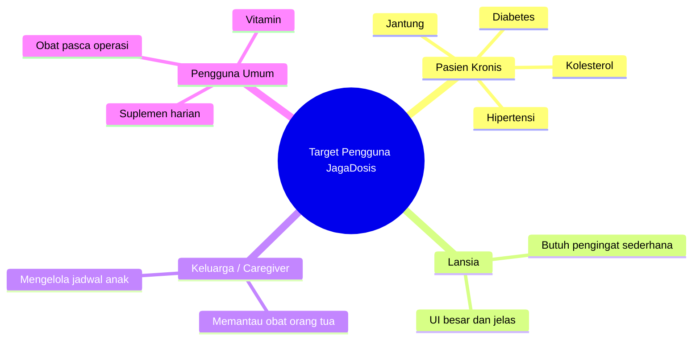
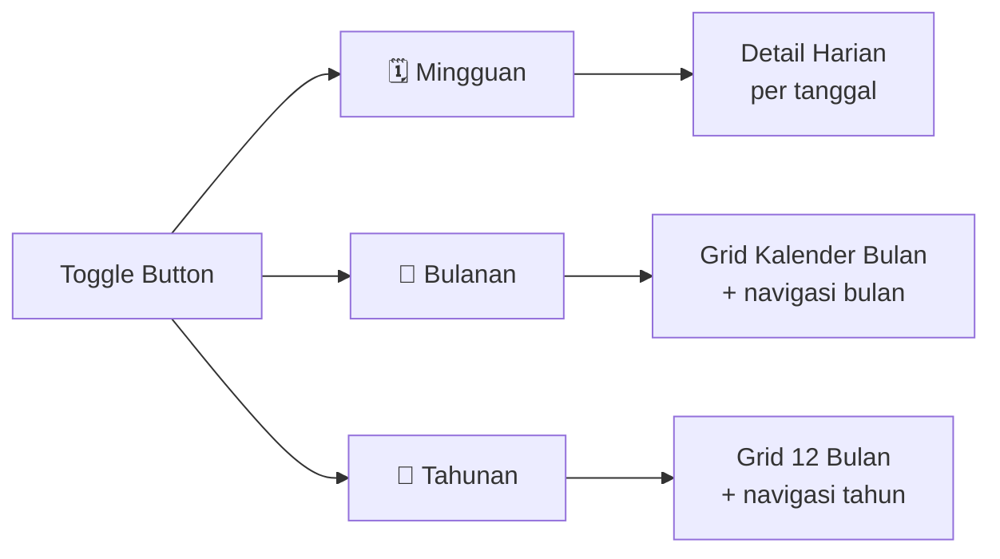
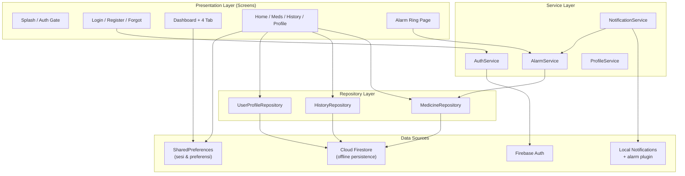
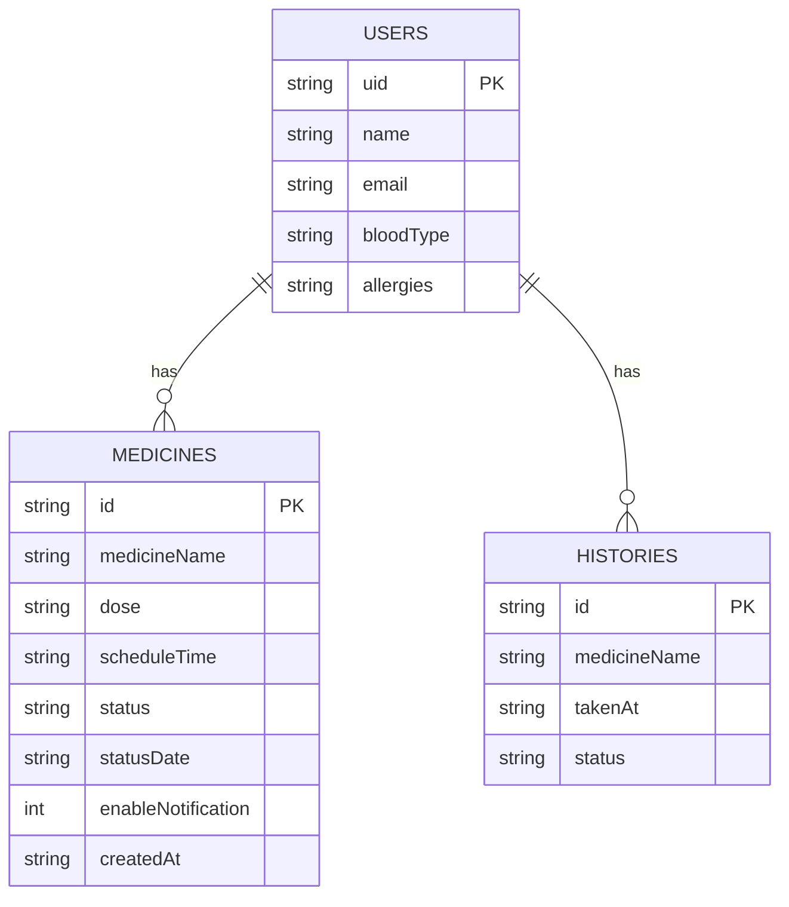
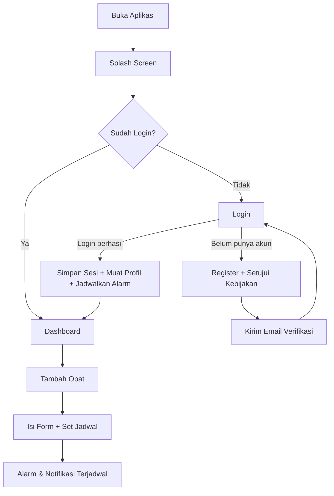
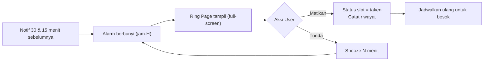

# 📋 Product Requirements Document (PRD)
# JagaDosis — Pendamping Pintar Jadwal Obat Anda

---

| **Informasi Dokumen** | |
|---|---|
| **Nama Produk** | JagaDosis |
| **Versi Dokumen** | 2.0 |
| **Versi Aplikasi** | 1.0.0+5 |
| **Tanggal** | 9 Juli 2026 |
| **Platform** | Android & iOS (Flutter) |
| **Bahasa Antarmuka** | Bahasa Indonesia |
| **Backend** | Firebase (Authentication + Cloud Firestore) |
| **Status** | In Development |

---

## 1. Executive Summary

**JagaDosis** adalah aplikasi mobile berbasis **Flutter** yang dirancang sebagai pendamping pintar untuk membantu pengguna mengelola jadwal minum obat secara teratur dan tepat waktu. Aplikasi ini menyediakan pencatatan obat, **alarm nyata** pada jam minum, pengingat notifikasi 30 & 15 menit sebelum jadwal, pelacakan riwayat konsumsi, serta monitoring tingkat kepatuhan minum obat harian — semuanya dengan antarmuka yang bersih, modern, dan mudah digunakan.

> [!IMPORTANT]
> Data pengguna disimpan di **Cloud Firestore** (per akun, berbasis Firebase Auth UID) dengan **offline persistence** — aplikasi tetap dapat membaca & menulis data saat tanpa koneksi, lalu otomatis tersinkron ketika kembali online. Sesi dan preferensi perangkat disimpan lokal via `SharedPreferences`.

> [!NOTE]
> Dokumen ini merefleksikan kondisi **branch `firebase`** (v1.0.0+5). Pada versi awal (v1.0) data disimpan secara lokal menggunakan SQLite; aplikasi telah **bermigrasi ke Firebase** untuk mendukung autentikasi aman, verifikasi email, dan sinkronisasi cloud.

---

## 2. Latar Belakang & Permasalahan

### 2.1 Konteks Permasalahan

Kepatuhan minum obat (*medication adherence*) merupakan salah satu tantangan terbesar dalam dunia kesehatan. Menurut WHO, sekitar **50% pasien dengan penyakit kronis tidak mengonsumsi obat sesuai resep**. Ketidakpatuhan ini menyebabkan:

- ⚠️ Memburuknya kondisi kesehatan pasien
- 💰 Meningkatnya biaya perawatan kesehatan
- 🏥 Meningkatnya angka rawat inap ulang
- ❌ Resistensi obat (terutama antibiotik)

### 2.2 Gap yang Diatasi

| Masalah | Solusi JagaDosis |
|---|---|
| Lupa jadwal minum obat | **Alarm nyata** berbunyi tepat pada jam minum + notifikasi 30/15 menit sebelumnya |
| Notifikasi biasa mudah diabaikan | Alarm full-screen dengan suara & getar, tombol Matikan/Tunda (Snooze) |
| Tidak ada catatan konsumsi obat | Riwayat konsumsi obat terdokumentasi (harian/bulanan/tahunan) |
| Sulit memantau kepatuhan | Dashboard kepatuhan harian visual (circular progress) |
| Data hilang saat ganti perangkat | Sinkronisasi cloud via Cloud Firestore per akun |
| Keamanan akun | Firebase Authentication + verifikasi email |
| Aplikasi kesehatan berbahasa asing | Antarmuka sepenuhnya Bahasa Indonesia |

---

## 3. Tujuan Produk

### 3.1 Tujuan Utama
1. **Meningkatkan kepatuhan minum obat** melalui sistem alarm + pengingat berlapis
2. **Menyediakan catatan konsumsi obat** yang rapi, tersinkron, dan mudah diakses
3. **Memberikan visualisasi kepatuhan** harian yang memotivasi pengguna
4. **Menjaga keamanan & privasi data** pengguna (auth + persetujuan kebijakan)

### 3.2 Key Results (KR)
- KR1: Pengguna dapat mencatat & mengelola ≥1 jadwal obat aktif
- KR2: Alarm berbunyi tepat waktu pada setiap jam dosis, dengan pengulangan harian
- KR3: Pengguna dapat melacak riwayat minum obat harian, bulanan, dan tahunan
- KR4: Pengguna mendapatkan feedback visual kepatuhan minum obat
- KR5: Registrasi (dengan verifikasi email) dan login berjalan aman & lancar

---

## 4. Target Pengguna

### 4.1 Persona Utama



### 4.2 Karakteristik Pengguna

| Aspek | Detail |
|---|---|
| **Usia** | 18 – 70+ tahun |
| **Kemampuan Teknologi** | Dasar hingga menengah |
| **Kebutuhan Aksesibilitas** | Font besar, kontras warna tinggi |
| **Bahasa** | Indonesia |
| **Konektivitas** | Butuh internet saat registrasi/login; operasi harian tetap jalan offline (cache Firestore) |

---

## 5. Fitur-Fitur Produk

### 5.1 Modul Autentikasi (Authentication) — Firebase Auth

#### F-AUTH-01: Splash Screen
- Layar pembuka dengan animasi premium (logo scale + fade + tagline).
- Menampilkan tagline: *"Pendamping Pintar Jadwal Obat Anda"*.
- Mengecek status sesi → jika sudah login, langsung ke Dashboard; jika belum, ke Login.
- **File**: `lib/screens/splash/splash_screen.dart`

#### F-AUTH-02: Registrasi Pengguna
- Formulir pendaftaran akun baru (Nama, Email, Kata Sandi).
- Menggunakan `FirebaseAuth.createUserWithEmailAndPassword`.
- Menyimpan nama sebagai `displayName`, lalu **mengirim email verifikasi**.
- Menyimpan profil awal ke Firestore (`users/{uid}`) beserta **versi persetujuan** kebijakan privasi & syarat ketentuan (`consentVersion`, `termsVersion`, `consentAcceptedAt`).
- **File**: `lib/screens/auth/register_page.dart`, `lib/services/auth_service.dart`

#### F-AUTH-03: Login Pengguna
- Formulir masuk (Email + Kata Sandi dengan toggle visibility).
- Menggunakan `FirebaseAuth.signInWithEmailAndPassword`.
- Menyimpan sesi lokal via `SharedPreferences` (`isLogin`, `userName`, `userEmail`).
- Setelah login, memuat profil dari Firestore & menjadwalkan ulang alarm/notifikasi.
- **File**: `lib/screens/auth/login_page.dart`

#### F-AUTH-04: Verifikasi Email
- Pengguna harus memverifikasi email agar akses penuh (guard).
- Dapat mengirim ulang email verifikasi & me-refresh status verifikasi.
- **File**: `lib/utils/email_verification_guard.dart`, `lib/screens/auth/auth_gate.dart`

#### F-AUTH-05: Lupa Kata Sandi
- Reset kata sandi via `FirebaseAuth.sendPasswordResetEmail`.
- **File**: `lib/screens/auth/forgot_password_page.dart`

#### F-AUTH-06: Manajemen Sesi & Sign-Out
- `SharedPreferences` menyimpan status login & identitas ringkas untuk auto-login.
- Saat logout: `FirebaseAuth.signOut`, hapus data PII lokal (foto, data diri) agar tidak bocor ke akun berikutnya di perangkat bersama, dan batalkan semua alarm/notifikasi.
- **File**: `lib/database/preference_handler.dart`, `lib/services/auth_service.dart`

#### Pesan Error Terlokalisasi
`AuthService.messageFromException` menerjemahkan `FirebaseAuthException` ke Bahasa Indonesia (mis. *"Email atau kata sandi salah."*, *"Email ini sudah terdaftar."*, *"Tidak ada koneksi internet."*).

---

### 5.2 Modul Dashboard & Navigasi

#### F-DASH-01: Bottom Navigation Bar (4 Tab)

| Index | Label | Icon (Active) | Icon (Inactive) |
|---|---|---|---|
| 0 | Beranda | `home_rounded` | `home_outlined` |
| 1 | Riwayat | `history_rounded` | `history_outlined` |
| 2 | Obat | `medical_services_rounded` | `medical_services_outlined` |
| 3 | Profil | `person_rounded` | `person_outline_rounded` |

- AnimatedContainer dengan transisi warna & bold text pada tab aktif.
- **File**: `lib/screens/dashboard_page.dart`

#### F-DASH-02: Halaman Beranda (Home Page)
- Sapaan dinamis (Pagi/Siang/Malam) + nama pengguna.
- Tanggal hari ini format Indonesia (mis. *"Rabu, 9 Juli 2026"*).
- Kartu kepatuhan harian (circular progress + persentase).
- Jadwal terdekat (dose slot berstatus `pending`) + tombol **Tandai Sudah Diminum**.
- Pull-to-Refresh.
- **File**: `lib/screens/home/home_page.dart`

---

### 5.3 Modul Manajemen Obat (Medication Management)

#### F-MED-01: Daftar Obat Aktif
- Daftar semua obat + badge counter, icon dinamis per jenis obat, menu konteks (Ubah/Hapus), FAB Tambah Obat, empty state.
- **File**: `lib/screens/meds/medicine_page.dart`

#### F-MED-02: Tambah / Ubah Obat
- **Informasi dasar**: Nama Obat, Dosis + Satuan (Tablet, Kapsul, sdm, sdt, Tetes, Semprot, Sachet).
- **Aturan pakai & waktu**: Frekuensi (1x–4x sehari / sesuai kebutuhan), hubungan dengan makanan (sebelum/sesudah/bersama/sebelum tidur), dan **beberapa waktu konsumsi** (time picker, jumlah menyesuaikan frekuensi).
- Menyimpan ke Firestore & **langsung menjadwalkan alarm + notifikasi** untuk setiap slot waktu.
- **File**: `lib/screens/meds/medicine_form_page.dart`

#### F-MED-03: Hapus Obat
- Konfirmasi → hapus dokumen di Firestore → batalkan seluruh alarm/notifikasi obat tsb.

#### F-MED-04: Status Per-Slot & Reset Harian
- Setiap obat menyimpan **status per slot waktu** (comma-separated, paralel dengan `scheduleTime`), mis. `"taken, pending"` untuk obat 2x sehari.
- `statusDate` menandai tanggal status; status **otomatis ter-reset harian** (`resetDailyStatus`) sehingga obat kembali `pending` di hari baru.
- `createdAt` mencegah slot yang jamnya sudah lewat *sebelum* obat dibuat langsung dianggap `missed`.

#### F-MED-05: Tandai Sudah Diminum
- Update status slot terkait ke `taken`, catat entri baru ke koleksi `history`, perbarui tampilan kepatuhan.

---

### 5.4 Modul Pengingat: Alarm & Notifikasi

#### F-ALM-01: Alarm Nyata (package `alarm`)
- Menjadwalkan **alarm berbunyi tepat pada jam dosis (jam-H)** untuk tiap slot waktu.
- **Full-screen intent** (Android): layar alarm muncul walau app tertutup / layar terkunci.
- Suara loop + fade-in 3 detik, getar, dan nada dapat dikustomisasi.
- Karena package `alarm` bersifat *one-shot*, **pengulangan harian diemulasikan**: setelah dosis dikonfirmasi, slot dijadwalkan ulang untuk besok; `rescheduleAll()` juga dijalankan saat startup & saat app kembali ke foreground sebagai jaring pengaman.
- **File**: `lib/services/alarm_service.dart`, `lib/screens/alarm/alarm_ring_page.dart`

#### F-ALM-02: Layar Alarm Berbunyi (Ring Page)
- Menampilkan nama obat & jam dosis.
- Aksi: **Matikan** (tandai sudah diminum + jadwalkan ulang besok) atau **Tunda/Snooze** (default 10 menit, dapat diatur).
- **File**: `lib/screens/alarm/alarm_ring_page.dart`

#### F-ALM-03: Notifikasi Pengingat Dini (flutter_local_notifications)
- Dua notifikasi per slot waktu: **30 menit** dan **15 menit** sebelum jam dosis.
- Timezone-aware (`timezone` + `flutter_timezone`), `exactAllowWhileIdle`.
- Channel Android dipilih dinamis sesuai preferensi suara/getar.
- **File**: `lib/services/notification_service.dart`

#### F-ALM-04: Sinkronisasi Terpusat
- `NotificationService` menjadi *single façade*: setiap jadwalkan/batalkan/reschedule juga meneruskan ke `AlarmService`, sehingga alarm & notifikasi selalu konsisten.

---

### 5.5 Modul Riwayat Konsumsi (Consumption History)

Halaman riwayat dengan kalender interaktif & tiga mode tampilan.



- **Mingguan**: 7 hari (horizontal scroll); detail dikelompokkan Pagi/Siang/Malam; tombol "Hari Ini".
- **Bulanan**: grid kalender penuh + indikator dot pada tanggal yang punya log.
- **Tahunan**: grid 12 bulan + counter log per bulan.
- **Kartu adherence** dengan circular progress & motivational text.
- Query rentang tanggal berjalan langsung di Firestore (single-field index pada `takenAt`).
- **File**: `lib/screens/history/history_page.dart`, `lib/repositories/history_repository.dart`

---

### 5.6 Modul Profil Pengguna (User Profile)

#### F-PROF-01: Tampilan Profil
- Avatar (dapat mengganti foto via `image_picker`), nama pengguna, menu pengaturan, tombol Keluar.
- **File**: `lib/screens/profile/profile_page.dart`

#### F-PROF-02: Data Diri (Rekam Medis Ringkas)
- Tanggal lahir, jenis kelamin, golongan darah, alergi.
- Disimpan di Firestore (`users/{uid}`) & di-cache lokal untuk baca offline.
- **File**: `lib/screens/profile/data_diri_page.dart`, `lib/repositories/user_profile_repository.dart`

#### F-PROF-03: Pengaturan Notifikasi
- Toggle global pengingat, suara, getar, dan durasi Snooze.
- Perubahan memicu penjadwalan ulang agar berlaku pada pengingat berikutnya.
- **File**: `lib/screens/profile/notification_settings_page.dart`

#### F-PROF-04: Nada Alarm
- Memilih nada bawaan atau **mengimpor file audio sendiri** (`file_picker`), disalin ke direktori Documents aplikasi.
- Preview nada via `audioplayers`.
- **File**: `lib/screens/profile/alarm_sound_page.dart`

#### F-PROF-05: Kontak Darurat
- Menyimpan daftar kontak penting/dokter (disimpan sebagai JSON di `SharedPreferences`), dapat ditelepon via `url_launcher`.
- **File**: `lib/screens/profile/emergency_contacts_page.dart`

#### F-PROF-06: Pusat Bantuan
- FAQ & panduan penggunaan.
- **File**: `lib/screens/profile/help_center_page.dart`

#### F-PROF-07: Legal
- Halaman Kebijakan Privasi & Syarat-Ketentuan; versi persetujuan dicatat saat registrasi.
- **File**: `lib/screens/legal/privacy_policy_page.dart`, `lib/screens/legal/terms_and_conditions_page.dart`

---

## 6. Arsitektur Teknis

### 6.1 Pola Arsitektur (Layered)



### 6.2 Struktur Folder Project

```
lib/
├── main.dart                          # Entry point, init Firebase/alarm/notif, ring listener
├── firebase_options.dart              # Konfigurasi Firebase per platform
├── database/
│   └── preference_handler.dart        # SharedPreferences (sesi, data diri cache, preferensi)
├── models/
│   ├── user_profile_model.dart        # Profil & rekam medis pengguna
│   ├── medicine_model.dart            # Obat + status per-slot + reset harian
│   └── history_model.dart             # Riwayat konsumsi
├── repositories/
│   ├── medicine_repository.dart       # CRUD obat di Firestore (users/{uid}/medicines)
│   ├── history_repository.dart        # Query riwayat di Firestore (users/{uid}/history)
│   └── user_profile_repository.dart   # Profil di Firestore (users/{uid})
├── services/
│   ├── auth_service.dart              # Firebase Auth (register, login, verifikasi, reset)
│   ├── notification_service.dart      # Notifikasi 30/15 menit + façade penjadwalan
│   ├── alarm_service.dart             # Alarm nyata jam-H (package alarm)
│   ├── profile_service.dart           # Orkestrasi profil (Firestore + cache lokal)
│   └── medicine_events.dart           # Event/refresh antar layar
├── screens/
│   ├── splash/ · auth/ · alarm/
│   ├── home/ · meds/ · history/
│   ├── profile/ (data diri, notifikasi, nada alarm, kontak darurat, bantuan)
│   ├── legal/ (privacy policy, terms & conditions)
│   └── dashboard_page.dart
├── utils/
│   ├── app_colors.dart                # Design token warna
│   └── email_verification_guard.dart
└── extensions/
    └── navigator.dart                 # Helper navigasi
```

---

## 7. Data Model & Skema Database (Cloud Firestore)

Struktur berbasis dokumen, di-scope per pengguna melalui **Firebase Auth UID**. Firestore security rules memastikan tiap akun hanya mengakses datanya sendiri.

```
users/{uid}                      # Dokumen profil pengguna
   ├── medicines/{id}            # Sub-koleksi obat
   └── history/{id}              # Sub-koleksi riwayat konsumsi
```

### 7.1 Dokumen `users/{uid}` (UserProfile)

| Field | Tipe | Keterangan |
|---|---|---|
| `name` | string | Nama lengkap |
| `email` | string | Email akun |
| `birthDate` | string | Tanggal lahir |
| `gender` | string | Jenis kelamin |
| `bloodType` | string | Golongan darah |
| `allergies` | string | Riwayat alergi |
| `consentVersion` | string | Versi kebijakan privasi yang disetujui |
| `termsVersion` | string | Versi syarat & ketentuan yang disetujui |
| `consentAcceptedAt` | string (ISO-8601) | Waktu persetujuan |
| `updatedAt` | timestamp | Server timestamp saat penyimpanan |

### 7.2 Sub-koleksi `medicines/{id}` (MedicineModel)

| Field | Tipe | Keterangan |
|---|---|---|
| `id` | string | ID (timestamp ms) |
| `medicineName` | string | Nama obat |
| `dose` | string | Dosis + satuan + aturan pakai |
| `scheduleTime` | string | Waktu (comma-separated, `HH:mm`) |
| `status` | string | Status per-slot comma-separated (mis. `"taken, pending"`) |
| `statusDate` | string | Tanggal berlakunya status (untuk reset harian) |
| `enableNotification` | int (0/1) | Toggle pengingat per obat |
| `createdAt` | string (ISO-8601) | Waktu obat dibuat |

### 7.3 Sub-koleksi `history/{id}` (HistoryModel)

| Field | Tipe | Keterangan |
|---|---|---|
| `id` | string | ID (timestamp ms) |
| `medicineName` | string | Nama obat yang dikonsumsi |
| `takenAt` | string (ISO-8601) | Waktu konsumsi (sortable & rentang query) |
| `status` | string | `taken` / `missed` |



---

## 8. Tech Stack & Dependencies

| Kategori | Teknologi | Versi |
|---|---|---|
| **Framework** | Flutter | SDK ^3.11.5 |
| **Bahasa** | Dart | (bundled) |
| **Autentikasi** | firebase_auth | ^6.5.4 |
| **Database Cloud** | cloud_firestore | ^6.6.0 |
| **Core Firebase** | firebase_core | ^4.11.0 |
| **Alarm** | alarm | ^5.0.0 |
| **Notifikasi Lokal** | flutter_local_notifications | ^22.0.1 |
| **Timezone** | timezone + flutter_timezone | ^0.11.0 / ^5.1.0 |
| **Audio** | audioplayers | ^6.1.0 |
| **Preferensi Lokal** | shared_preferences | ^2.5.5 |
| **Pilih Gambar** | image_picker | ^1.1.2 |
| **Pilih File** | file_picker | ^8.1.4 |
| **Buka URL/Telepon** | url_launcher | ^6.3.0 |
| **Path** | path + path_provider | ^1.9.1 / ^2.1.5 |
| **Tipografi** | google_fonts | ^8.1.0 |
| **Internasionalisasi** | intl | ^0.20.2 |
| **App Icon** | flutter_launcher_icons | ^0.14.4 |

---

## 9. Design System

### 9.1 Color Palette (`lib/utils/app_colors.dart`)

| Nama Token | Hex Code | Penggunaan |
|---|---|---|
| `medicalBlue` | `#005AB6` | Primary, CTA, nav aktif |
| `backgroundBlue` | `#F9F9FF` | Background utama |
| `surfaceWhite` | `#FFFFFF` | Surface kartu |
| `primaryContainer` | `#D7E3FF` | Container ringan |
| `onPrimaryContainer` | `#001B3F` | Teks di atas container |
| `textDark` | `#191C22` | Teks utama |
| `textGrey` | `#414753` | Teks sekunder |
| `outlineVariant` | `#C1C6D5` | Border/outline |
| `wellnessGreen` | `#006D37` | Status sukses/taken |

### 9.2 Tipografi
- **Heading**: Plus Jakarta Sans (Bold) — via `google_fonts`
- **Body**: Inter (Regular/Medium)

### 9.3 Komponen
- **Border Radius**: 8–16px
- **Shadow**: subtle (`black.withAlpha(5–15)`, blur 8–24px)
- **Spacing**: grid 4px
- **Animasi**: 200–300ms, easeInOut/elasticOut
- **Material 3** dengan `ColorScheme.fromSeed`

---

## 10. User Flow

### 10.1 Onboarding (Pertama Kali)



### 10.2 Alur Alarm Harian



---

## 11. Non-Functional Requirements

### 11.1 Performa
| Metrik | Target |
|---|---|
| Cold start (splash → dashboard) | ≤ 5 detik |
| Baca data (obat/riwayat) | Cepat via cache Firestore (≤ 500ms lokal) |
| Akurasi alarm | Tepat pada menit terjadwal (exactAllowWhileIdle + alarm plugin) |
| Responsivitas UI | 60 fps pada mid-range device |

### 11.2 Keamanan & Privasi
| Aspek | Status Saat Ini |
|---|---|
| Autentikasi | ✅ Firebase Auth (email/password) + verifikasi email |
| Password | ✅ Dikelola & di-hash oleh Firebase (tidak disimpan aplikasi) |
| Isolasi data antar user | ✅ Data di-scope per UID + Firestore security rules |
| Persetujuan kebijakan | ✅ Versi privasi & syarat dicatat saat registrasi |
| PII lokal | ✅ Dihapus saat logout agar tidak bocor di perangkat bersama |

### 11.3 Reliabilitas
- **Offline-first**: tulis/baca ke cache Firestore saat offline, sinkron otomatis saat online (timeout tulis 3 detik agar UI tidak menggantung).
- **Jaring pengaman alarm**: reschedule saat startup & saat app resume agar hari tidak terlewat.

### 11.4 Kompatibilitas
- **Android**: API 21+
- **iOS**: iOS 12.0+

---

## 12. Analisis Risiko & Mitigasi

| # | Risiko | Dampak | Mitigasi |
|---|---|---|---|
| R1 | Alarm tidak bunyi saat app di-kill / OEM agresif (Xiaomi/Oppo) | 🔴 Tinggi | Full-screen intent, exact alarm permission, reschedule saat resume/startup; edukasi izin baterai |
| R2 | Ketergantungan koneksi saat login/registrasi | 🟡 Sedang | Pesan error jaringan yang jelas; operasi harian tetap offline via cache |
| R3 | Data lokal (kontak darurat) belum ikut tersinkron cloud | 🟡 Sedang | Roadmap: pindahkan ke Firestore |
| R4 | Belum ada multi-profil dalam satu akun | 🟢 Rendah | Roadmap: profil keluarga |
| R5 | Ketergantungan izin notifikasi (Android 13+) | 🟡 Sedang | Minta izin saat init; fallback informatif |

---

## 13. Roadmap Pengembangan

### Phase 1: MVP Lokal ✅ (v1.0)
- [x] Autentikasi lokal, CRUD obat, dashboard, riwayat, profil (berbasis SQLite)

### Phase 2: Migrasi Firebase & Pengingat ✅ (Current — v1.0.0+5)
- [x] Migrasi ke Firebase Auth + Cloud Firestore (offline persistence)
- [x] Verifikasi email & persetujuan kebijakan (privacy & terms)
- [x] Alarm nyata jam-H (full-screen) + snooze
- [x] Notifikasi pengingat 30 & 15 menit sebelum jadwal
- [x] Status obat per-slot + reset harian otomatis
- [x] Nada alarm kustom, pengaturan notifikasi, kontak darurat, pusat bantuan
- [x] Data diri / rekam medis ringkas tersinkron cloud

### Phase 3: Scale (v2.0.0)
- [ ] Ekspor riwayat ke PDF/CSV
- [ ] Gamifikasi kepatuhan (streak, achievement)
- [ ] Multi-profil / profil keluarga dalam satu akun
- [ ] Auto-suggest nama obat (integrasi data farmasi)
- [ ] Dark mode & lokalisasi multi-bahasa
- [ ] Sinkronisasi kontak darurat ke cloud

---

> [!TIP]
> Dokumen PRD ini disusun berdasarkan analisis langsung terhadap source code JagaDosis pada branch `firebase` (v1.0.0+5). Seluruh fitur, arsitektur, dan data model mencerminkan implementasi aktual pada codebase saat ini.
